# 🌌 Universe Map

**An interactive, animated 3D map of everything — from the satellites over your head right now, out past the observable universe, into the multiverse. Plus a flight mode, a tech map, daily games, daily videos, live news, and a search box that knows 6,500+ objects by name.**

Scroll to zoom. When you reach the edge of one scale, keep scrolling and you travel to the next: **Earth → the Solar System → the Milky Way → the Local Group → the Observable Universe → the Multiverse**. Every planet, moon, star, exoplanet, galaxy, satellite, probe, comet, nebula and pulsar is clickable, with real astronomical data and a written story.

Built with [Three.js](https://threejs.org/) and vanilla JavaScript. No build step, no framework, no backend, no API keys — clone it and serve it.

```bash
git clone https://github.com/coopermitchell007-pixel/Universe-Map.git
cd Universe-Map
python3 -m http.server 8765
# open http://localhost:8765
```

---

## 🆕 Latest update

- **⚡ The Tech Map is now a giant circuit board** — processor chips with heatsinks, copper traces, flowing signal pulses and blinking LEDs.
- **🚀 Flight mode has a real glass cockpit** with a Newtonian 6-DOF flight model: throttle, afterburner + fuel, RCS thrusters, roll, inertial dampeners, an artificial horizon, G-meter, prograde/target markers, target-lock autopilot and hyperspace streaks.
- **🎞 Cinematic look** — UnrealBloom glow over a colourful nebula backdrop (graceful fallback if the CDN is unreachable, so it always boots).
- **🧑‍🚀 An astronaut avatar** that rides along and lands on your postcards.
- **⚙ A control centre** — settings, FPS meter, clean view, fullscreen, bookmarks, a guided "Powers of Ten" tour, a 🎲 Surprise-me button, keyboard shortcuts (**1–6**, **H/F/P/M/?**), and a 🫧 Rick & Morty easter egg in the multiverse.

---

## 🔍 Search anything

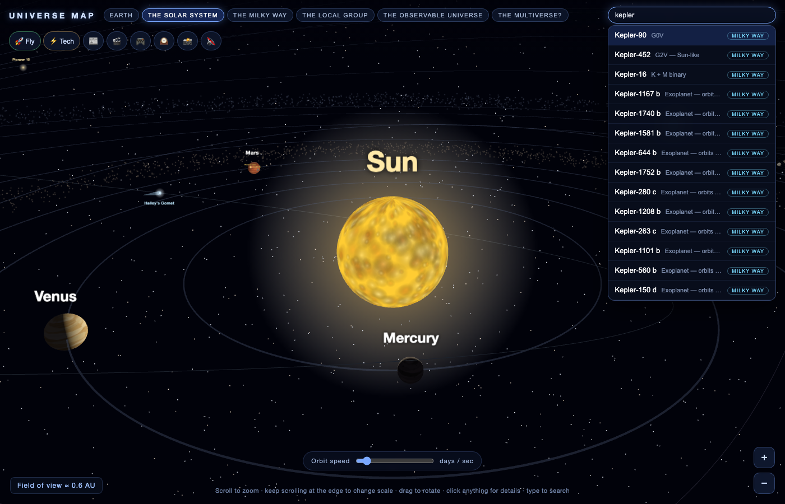

The search box indexes **everything on the map by name** — all 17 (dwarf) planets, 30 detailed moons, all 177 catalogued moons, 45 named stars, **all 6,298 confirmed exoplanets**, ~150 live-tracked satellites, 10 galaxies, the deep-space probes, comets, nebulae, pulsars, today's near-Earth asteroids, cosmic landmarks… Type `Europa`, `TRAPPIST-1 e`, `STARLINK-3041`, or `Voyager 1` and the camera flies across the universe to it and opens its panel.

Every object also gets a **shareable deep link**: the URL hash updates as you click (`#o/Titan`), and opening that link jumps straight there.

## 🚀 Flight mode — now with a real cockpit & Newtonian physics

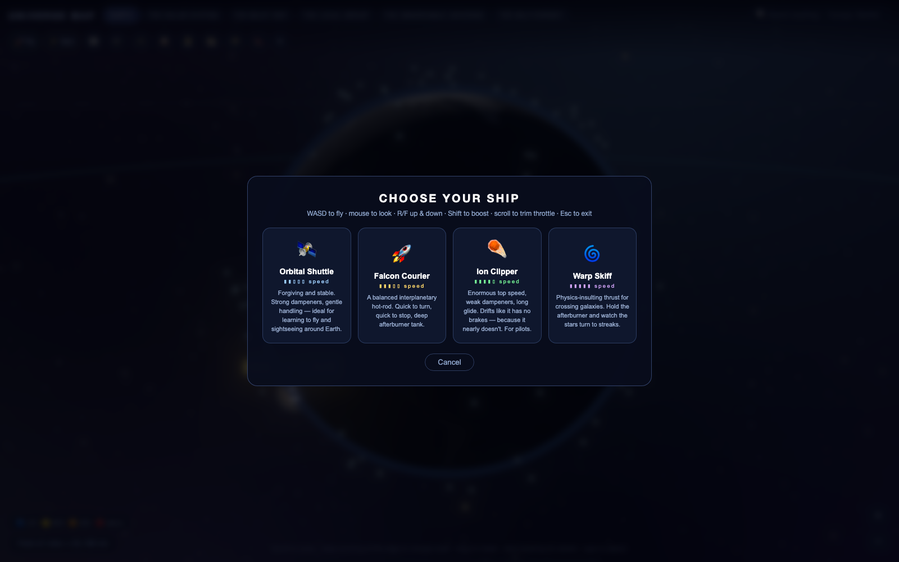
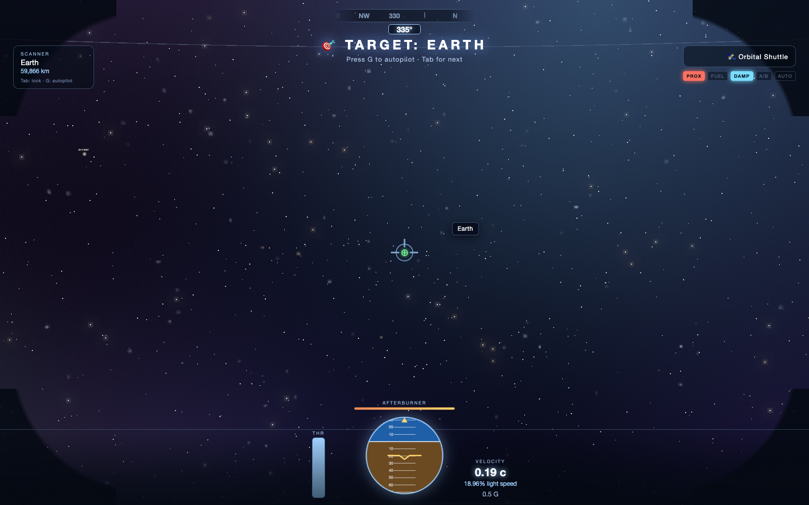

Press **🚀 Fly**, choose a ship, and pilot it yourself from inside a full glass cockpit:

| Ship | Thrust | Dampeners | Character |
|---|---|---|---|
| 🛰 **Orbital Shuttle** | low | strong | Forgiving and stable — the trainer. Sightseeing around Earth and the ISS |
| 🚀 **Falcon Courier** | medium | medium | Balanced interplanetary hot-rod, deep afterburner tank |
| ☄️ **Ion Clipper** | high | weak | Huge top speed, long glide — drifts like it has no brakes |
| 🌀 **Warp Skiff** | extreme | medium | Physics-insulting thrust for crossing galaxies |

**Real 6-DOF flight model.** The mouse steers (pitch + yaw), **A/D** rolls, **Q/E/R/F** fire lateral and vertical thrusters, **W/S** work the throttle, **Shift/Space** lights the afterburner (which burns a regenerating fuel tank), and **X** cuts the engines for a full stop. Press **Z** to toggle **inertial dampeners**: ON, it auto-levels and bleeds velocity toward your nose like an aircraft; OFF, it's pure momentum — you keep every bit of speed and spin and drift like an actual spacecraft.

**The cockpit instruments are live:** an artificial horizon (attitude indicator) with a pitch ladder and roll pointer, a sliding heading compass, a throttle gauge, an afterburner fuel bar, a velocity readout that climbs from m/s → km/s → Mach → **% of light speed**, a G-meter that redlines in hard turns, warning lamps (PROX · FUEL · DAMP · A/B · AUTO), and **prograde / retrograde / target markers** projected onto the canopy. A scanner finds the nearest world; **Tab** locks a target and **G** flies you there on autopilot. Past half light-speed the stars smear into **hyperspace streaks**, and the afterburner rattles the canopy. Fly past the edge of a level and you punch straight through into the next scale.

## ⚡ The Tech Map — a giant circuit board

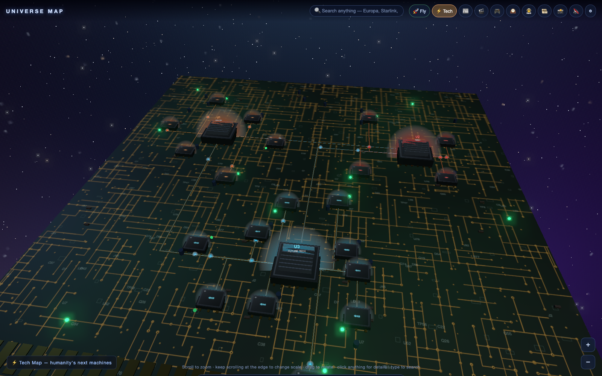

A second, separate 3D world — press **⚡ Tech** to drop down onto a **printed circuit board** of humanity's next machines. Three **processor chips** (with engraved labels, gold pins and finned heatsinks that glow) sit on an FR4 substrate, wired to **20 component chips** by **copper traces** with **signal pulses** flowing along them. Blinking status LEDs, capacitors, resistors and a gold edge-connector fill the board. Every chip is clickable:

- **SPACEX `U1`** — Starship, Falcon 9, the Raptor engine, Starlink, Dragon, and the full Mars colonisation plan
- **TESLA `U2`** — FSD & robotaxis, the Optimus humanoid robot, Megapack grid storage, Cybertruck
- **FUTURE TECH `U3`** — fusion power, space elevators, Dyson swarms, asteroid mining, O'Neill cylinders, nuclear propulsion, Breakthrough Starshot, terraforming Mars, brain interfaces, AI in space exploration

While the Tech Map is open, the **news drawer switches to tech filters** (Starship, Starlink, Artemis, Rockets, Blue Origin) and the **video drawer opens on the Engineering playlist**. Press ⚡ again to fly back out to the universe.

## 🎬 Cinematic mode, the tour, your astronaut & the control centre

- **Cinematic glow.** The whole map now renders through an **UnrealBloom** post-processing pipeline over a **colourful nebula backdrop**, so stars, engines and galaxies actually glow. Toggle it and tune its strength in **⚙ Settings** (and it's captured in your postcards).
- **🧑‍🚀 Your astronaut.** Hit the spaceman button and a little cosmonaut rides along in the corner of the view — and turns up in every postcard you take. *Wish you were here.*
- **🎞 Guided tour.** One button flies you on a cinematic "Powers of Ten" journey from Earth out to the multiverse, with narration cards and a slow auto-orbit at each stop.
- **⚙ Settings & help.** Bloom controls, an FPS meter, a **clean-view** mode that hides all UI for screenshots, fullscreen, **bookmarks** (save and re-fly any camera view, stored in your browser), a cinematic **auto-spin**, and a **🎲 Surprise me** button that flies you to a random object out of the 6,500+ indexed. Press **?** any time for the full controls card.
- **Keyboard shortcuts.** **1–6** jump between scales, **H** hides the UI, **F** fullscreen, **P** postcard, **M** sound, **?** help.
- **🫧 Easter egg.** Somewhere in the multiverse, off among the serious theories, floats **Dimension C-137**. Wubba lubba dub dub.

---

## ✨ The six levels

### 🌍 Earth

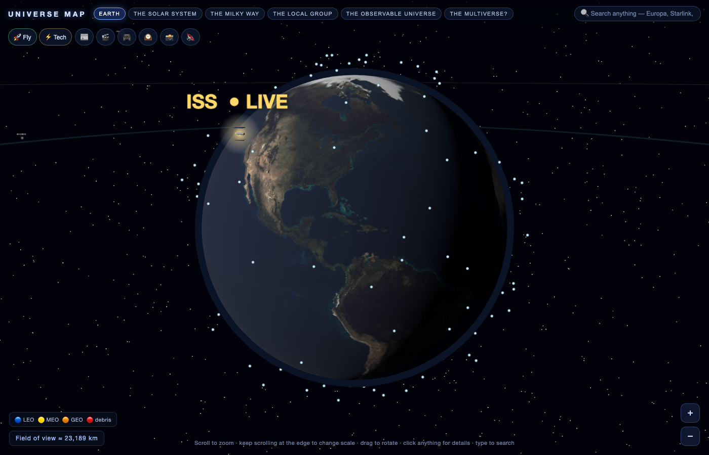

- **Real day/night terminator.** The sunlight direction is computed from the actual solar declination and hour angle *right now* — the dark half of Earth in the map is the half where it is currently night.
- **The ISS, live** — position fetched every 5 seconds from [Where The ISS At?](https://wheretheiss.at/); open its panel and watch the numbers tick.
- **~150 real satellites, propagated in real time** with the SGP4 model from live [CelesTrak](https://celestrak.org/) TLEs, **colour-coded by orbit**: 🔵 LEO · 🟡 MEO · 🟠 GEO · 🔴 debris. Click any dot and it tells you *what it is* (Starlink, weather satellite, spy-era relic, spent rocket stage…), its NORAD number, launch year, inclination, period, and live altitude/position/speed.
- **Today's real near-Earth asteroids** from NASA's NeoWs feed — the actual rocks making close approaches *today*, with their size, miss distance and speed. Potentially hazardous ones glow red.
- The Moon at its true distance (60 Earth radii), and the geostationary ring.

### ☀️ The Solar System

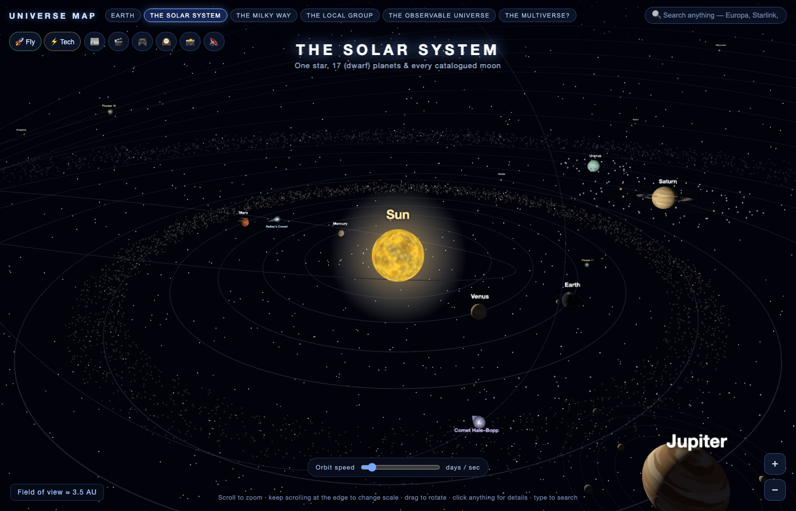

- The Sun, all **8 planets** and **9 dwarf planets** orbiting at real relative periods on a time-warp slider, with **30 major moons** as textured 3D worlds and **all 177 catalogued moons** as clickable dots (real NASA data bundled).
- **🧑‍🚀 "Stand on the surface"** — every planet and moon's panel has a button that puts you *on the ground*, looking up: Jupiter looming over Europa's ice, Saturn hanging in Titan's sky. Esc lifts you back to orbit.
- **The five deep-space probes** — Voyager 1 & 2, New Horizons, Pioneer 10 & 11 — at their real (scaled) positions, with **live distance counters extrapolated from their actual speed**. Watch Voyager 1's odometer grow in real time.
- **Comets with anti-sunward tails** — Halley (retrograde, returning 2061) and Hale–Bopp ride real-shaped elliptical orbits; their tails always point away from the Sun and flare up near perihelion, exactly like the real thing.
- **The Mars rovers.** Perseverance (Jezero Crater) and Curiosity (Gale Crater) are pinned to the actual coordinates on the spinning planet, each with its story.
- Saturn's rings, the asteroid belt, the Kuiper belt.

### 🌀 The Milky Way

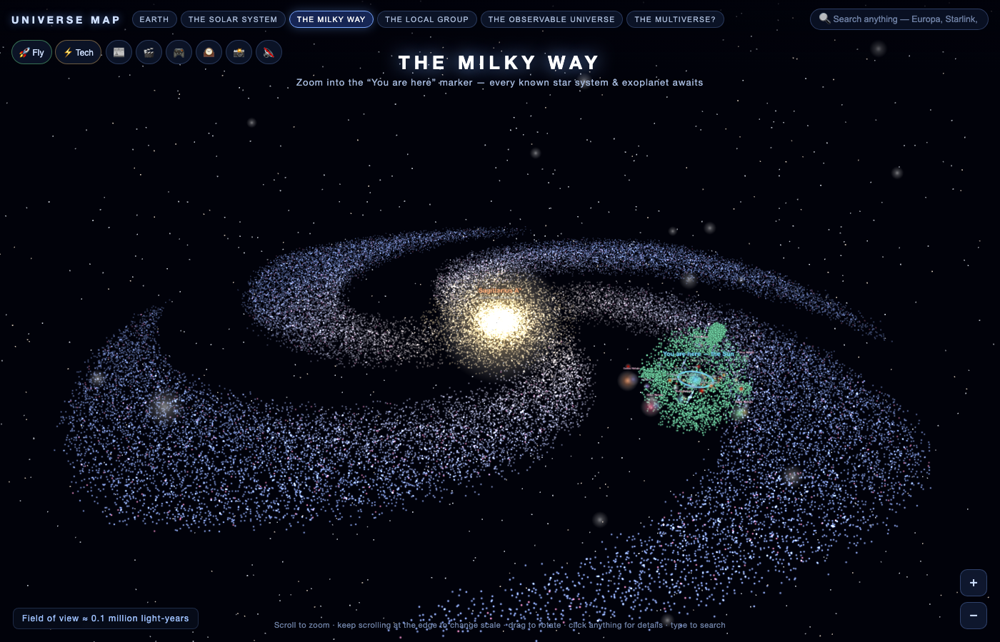

- A 48,000-star spiral with a pulsing **"You are here"** marker, and **Sagittarius A\*** now wearing a glowing **photon ring and accretion disc** — the lensed look from the Event Horizon Telescope image.
- **45 notable real stars** at log-compressed true distances — stars with known habitable-zone planets wear a **green halo ring**.
- **All 6,298 confirmed exoplanets** plotted in their true directions (the Kepler survey cone is visible in the cloud), every one clickable *and searchable by name*.
- **Six famous nebulae** — Orion, Crab, Eagle (Pillars of Creation), Carina (Cosmic Cliffs), Ring, and Helix — as glowing clouds with the stories behind the most famous astrophotos ever taken.
- **Two pulsars with sweeping lighthouse beams** you can watch rotate — the Crab Pulsar (born in the supernova of 1054 AD) and the glitching Vela Pulsar.

### 🌌 The Local Group

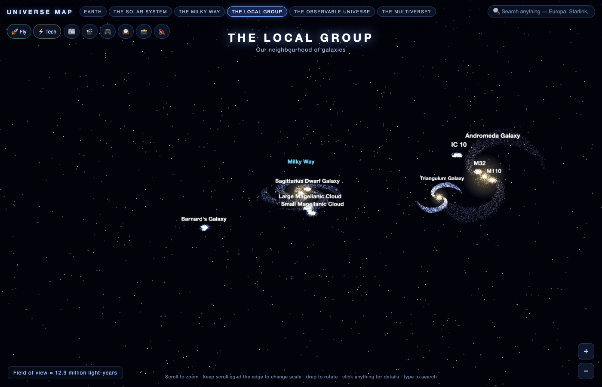

Ten real neighbouring galaxies in 3D. Andromeda's panel now carries the countdown: **T-minus ≈ 4.5 billion years, closing at 110 km/s right now.**

### 🕸 The Observable Universe

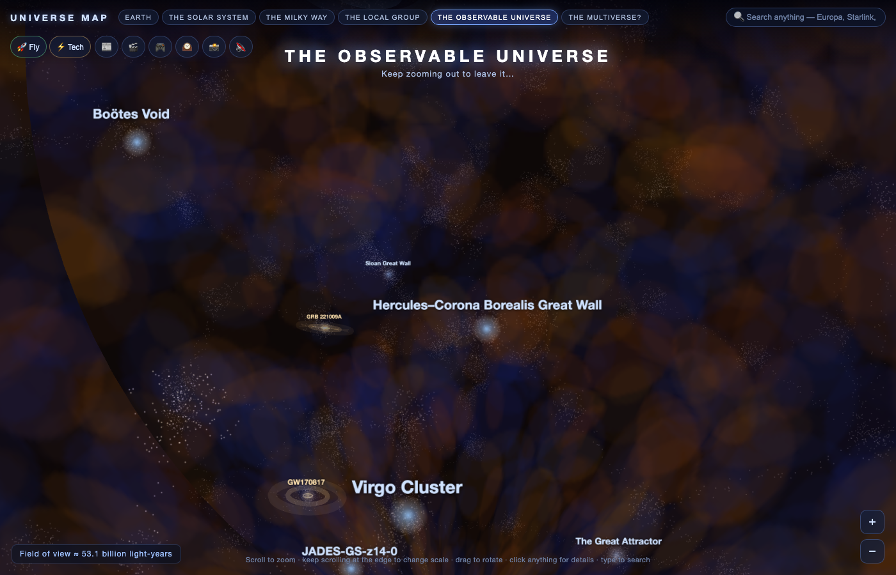

- A ~30,000-galaxy procedural **cosmic web**, nine clickable real landmarks (Laniakea, the Boötes Void, the Hercules–Corona Borealis Great Wall…), all wrapped in the **Cosmic Microwave Background**.
- **The most violent events ever recorded, rippling outward** as animated shockwaves:
  - **GRB 221009A "the BOAT"** — the brightest explosion ever seen, which physically disturbed Earth's atmosphere from 2.4 billion light-years away
  - **GW150914** — the first gravitational wave: two black holes converting three Suns of mass into ripples in spacetime
  - **GW170817** — the kilonova that proved where gold comes from

### 🫧 The Multiverse

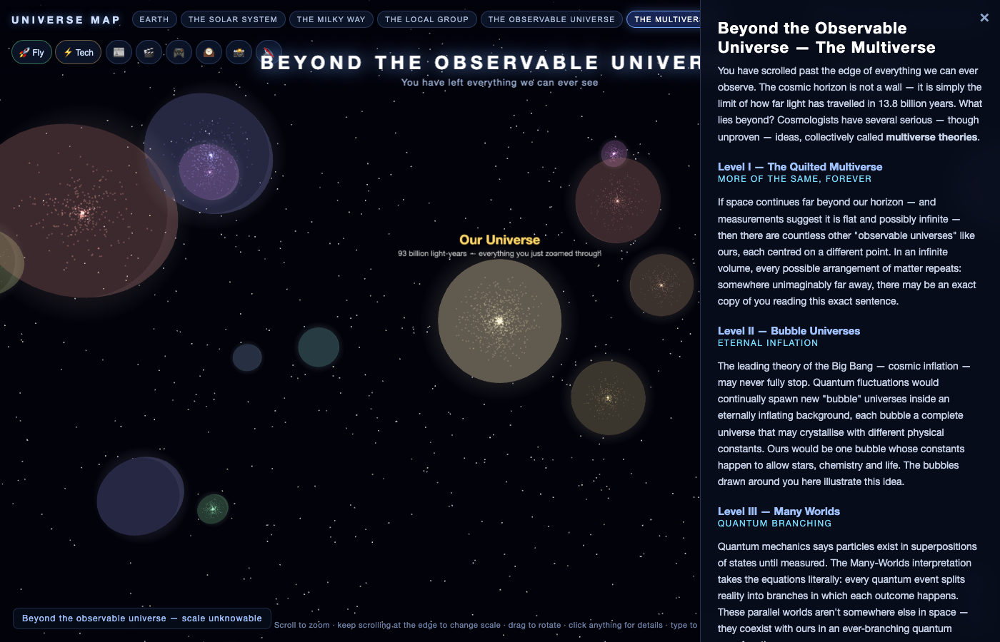

Scroll past the edge of everything observable and the map keeps going. Bubble universes float around you, each teaching one serious (unproven) theory: Tegmark's four levels, eternal inflation, Many-Worlds, the string landscape, cyclic cosmology, and the honest question of whether we could ever know.

---

## 🧠 Every info panel got smarter

Click *anything* with a known distance and the panel now computes, automatically:

- **"The light you're seeing left it X ago"** — click Andromeda and realise the light hitting your screen left before humans existed.
- **A travel-time table**: how long to get there by car, by jet, by the fastest probe ever launched, and at light speed. (Proxima Centauri by car: ~50 million years. Pack snacks.)

## 📰 Live space news · 🎬 Daily videos · 🎮 Daily games

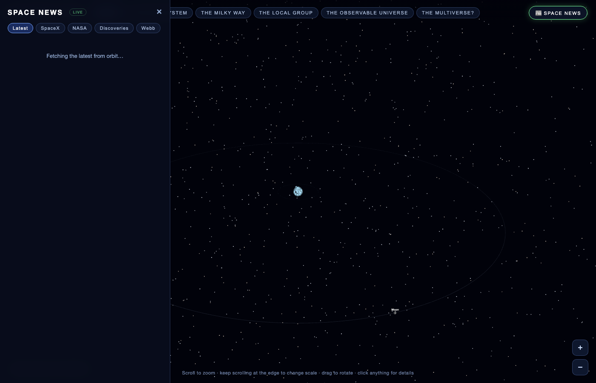
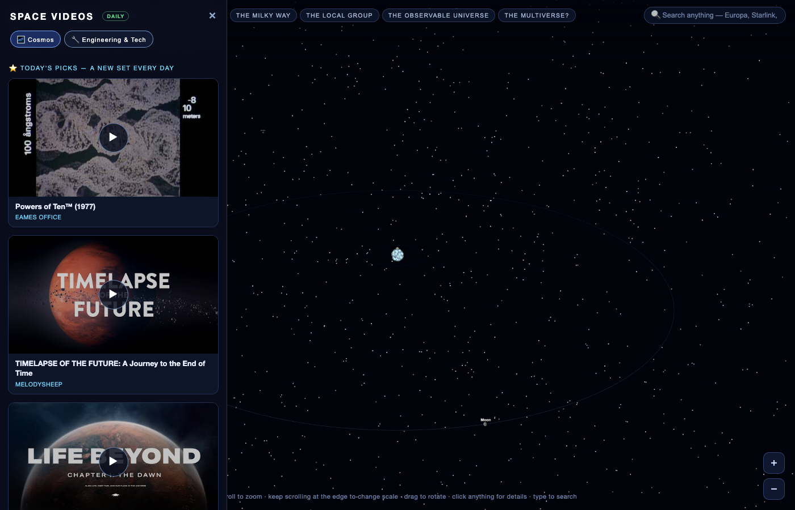
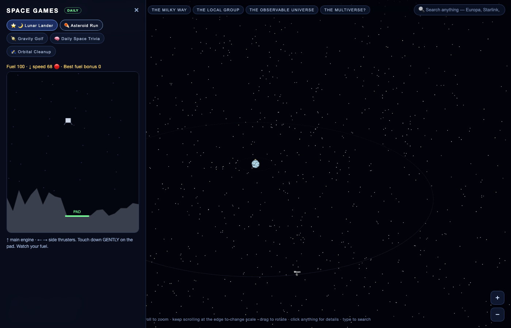

- **News** — live from the [Spaceflight News API](https://www.spaceflightnewsapi.net/), with filter chips (SpaceX / NASA / Discoveries / Webb — or tech filters in Tech-Map mode). Auto-refreshes every 10 minutes.
- **Videos** — a hand-curated, **link-verified** collection of 44 of the best space and engineering videos on the internet (Kurzgesagt, Veritasium, melodysheep, NASA, SpaceX, *Powers of Ten*, *Wanderers*…). **Six featured picks rotate every day.** Thumbnails load instantly; the player only loads when you press play.
- **Games** — five built-in mini-games, one featured per day:
  - ☄️ **Asteroid Run** — dodge & collect, speed ramps forever
  - 🌙 **Lunar Lander** — land gently or crumple, daily terrain
  - 🪐 **Gravity Golf** — slingshot a probe around planets into the ring; **a new 3-hole course is generated every day** (same course for everyone — compare shot counts)
  - 🧠 **Daily Space Trivia** — 7 questions drawn fresh each day from a pool, with explanations
  - 🛰 **Orbital Cleanup** — 60 seconds of catching cargo and dodging debris
  
  High scores persist in your browser.

## 🕰 The Cosmic Timeline · 📸 Postcards · 🔊 Sound

- **Timeline** — scrub a slider through 17 events from the Big Bang (T=0) through *NOW* to the heat death (10¹⁰⁰ years), each with a story. Starts at "NOW" so you can see how early in the universe's life you live.
- **Postcards** — the 📸 button captures your current view, stamps it with the object's name, the date and a wordmark, and downloads a PNG. Sunset on Titan, wish you were here.
- **Ambient sound** — a generated WebAudio soundscape (no audio files) that deepens as you zoom out: warm hum at Earth, abyssal drones at the cosmic web, something uneasy in the multiverse. Off by default; 🔇 toggles it.

---

## 🎮 Controls

| Action | Effect |
|---|---|
| **Scroll** | Zoom in / out |
| **Keep scrolling at the edge** | Travel to the next / previous scale |
| **Drag** | Rotate the view |
| **Click anything** | Info panel (+ camera follow for orbiting bodies) |
| **Type in the search box** | Find & fly to any of 6,500+ named objects |
| **1 – 6** | Jump straight to a scale (Earth → Multiverse) |
| **🚀 Fly** | Cockpit flight — mouse steer · W/S throttle · A/D roll · Q/E/R/F strafe · Shift boost · Z dampeners · X brake · Tab target · G autopilot |
| **🧑‍🚀 button in a panel** | Stand on that world's surface |
| **🧑‍🚀 toolbar button** | Show your astronaut (rides along & lands on postcards) |
| **⚡ Tech** | Switch to / from the circuit-board Tech Map |
| **🎞 / 🕰 / 📸 / 🔊 / ⚙** | Guided tour · timeline · postcard · ambient sound · settings |
| **H / F / P / M / ?** | Hide UI · fullscreen · postcard · sound · help |
| **Slider (Solar System)** | Orbit time-warp, 0–60 days/sec |
| **Esc** | Exit / close everything |
| **Double-click empty space** | Reset camera target |

Touch works too: one-finger drag rotates, pinch zooms, tap opens panels, and the **+/−** buttons cross between scales.

## 🛠 How it's built

```
index.html          UI shell, import map (Three.js from CDN), satellite.js
css/style.css       All styling — HUD, drawers, search, flight HUD, games
js/app.js           Scene, the six levels, picking/focus, live data, news,
                    search index & navigation, surface mode, travel calculator
js/data.js          Hand-written astronomy: planets, moons, stars, galaxies,
                    landmarks, multiverse theories, satellite classifier
js/extras.js        Probes (live distance), comets (Kepler-ish orbits),
                    nebulae, pulsars, GRB/GW ripples, NEO feed, photon ring
js/flight.js        Cockpit + Newtonian 6-DOF flight model & all the instruments
js/search.js        Search UI + random-pick (the index lives in app.js)
js/tech.js          The circuit-board Tech Map: chips, traces, signal pulses
js/postfx.js        Cinematic UnrealBloom post-processing (with fallback)
js/ui.js            Settings, help overlay, FPS, clean view, bookmarks
js/tour.js          Guided "Powers of Ten" cinematic tour
js/videos.js        44 verified videos, daily rotation, lite embeds
js/games.js         Five mini-games + seeded daily challenges
js/timeline.js      17 events, Big Bang → heat death
js/sound.js         Generated WebAudio ambience per level
js/postcard.js      Canvas compositing + download (captures the bloom view)
js/textures.js      Procedural canvas textures (now incl. PCB, nebula, astronaut)
data/moons.json     All 177 catalogued moons (NASA data)
data/exoplanets.json  All 6,298 confirmed exoplanets (NASA Exoplanet Archive)
docs/               Screenshots
```

**Design notes**

- The universe spans 26 orders of magnitude — far beyond floating-point precision — so the map uses **six discrete scale levels**, each with its own units (637 km/unit at Earth, ~1.1 billion ly/unit at the universe level). Crossing a boundary fades through black and swaps scenes; a live scale bar shows the field of view.
- **The day/night terminator is real**: solar declination from the day of year, subsolar longitude from UTC, and the sun-light rides inside Earth's rotating frame so the night side stays geographically correct.
- **Probe distances are extrapolated live** from a 2026 epoch + each probe's actual speed — the panel's kilometre counter genuinely grows as you watch.
- **Comet tails point anti-sunward** and scale with 1/r — computed per frame from the comet's position on its (scaled) real-eccentricity ellipse.
- **"Daily" everything** derives from `floor(now / 86400000)`: the featured game, the trivia set, the Gravity Golf course and the video picks are the same for every visitor on a given day, with zero server.
- **All 44 video links were verified** against YouTube's oEmbed API before being bundled — no dead embeds.
- Picking uses a raycaster whose point-cloud tolerance scales with camera distance, with priority for small named markers over the clouds they sit inside.
- Satellite identity (launch year, NORAD ID, inclination, period) is parsed from raw TLE fields; a name-pattern classifier sorts objects into 16 human-readable categories.
- The search index is built by walking every scene graph for named objects, then point-cloud datasets (exoplanets, satellites, catalogued moons) register their thousands of entries as they load.

## 📡 Data sources & credits

| Data | Source |
|---|---|
| ISS live position | [Where The ISS At?](https://wheretheiss.at/) API |
| Satellite orbits (TLEs) | [CelesTrak](https://celestrak.org/) · propagated with [satellite.js](https://github.com/shashwatak/satellite-js) (SGP4) |
| Near-Earth asteroids | [NASA NeoWs](https://api.nasa.gov/) (today's real close approaches) |
| Exoplanets (6,298) | [NASA Exoplanet Archive](https://exoplanetarchive.ipac.caltech.edu/) (`pscomppars`) |
| Moon catalog (177) | NASA planetary satellite data via [devstronomy](https://github.com/devstronomy/nasa-data-scraper) |
| Space news | [Spaceflight News API](https://www.spaceflightnewsapi.net/) |
| Videos | YouTube embeds — Kurzgesagt, Veritasium, melodysheep, NASA, SpaceX, et al. (each verified via oEmbed) |
| Probe states | NASA/JPL published positions & speeds (2026 epoch, extrapolated) |
| Earth / Moon photo textures | [three.js examples](https://github.com/mrdoob/three.js) |
| 3D engine | [Three.js](https://threejs.org/) |
| Astronomical facts | NASA, ESA, IAU public data — distances, masses and dates as published |

*Stylised for visibility: orbital distances within levels are compressed (a true-scale solar system is a screen of black), star/exoplanet distances are log-compressed, NEO positions are illustrative, and the cosmic web is procedural — but every number in every info panel is real.*

---

*Built with [Claude Code](https://claude.com/claude-code).*
